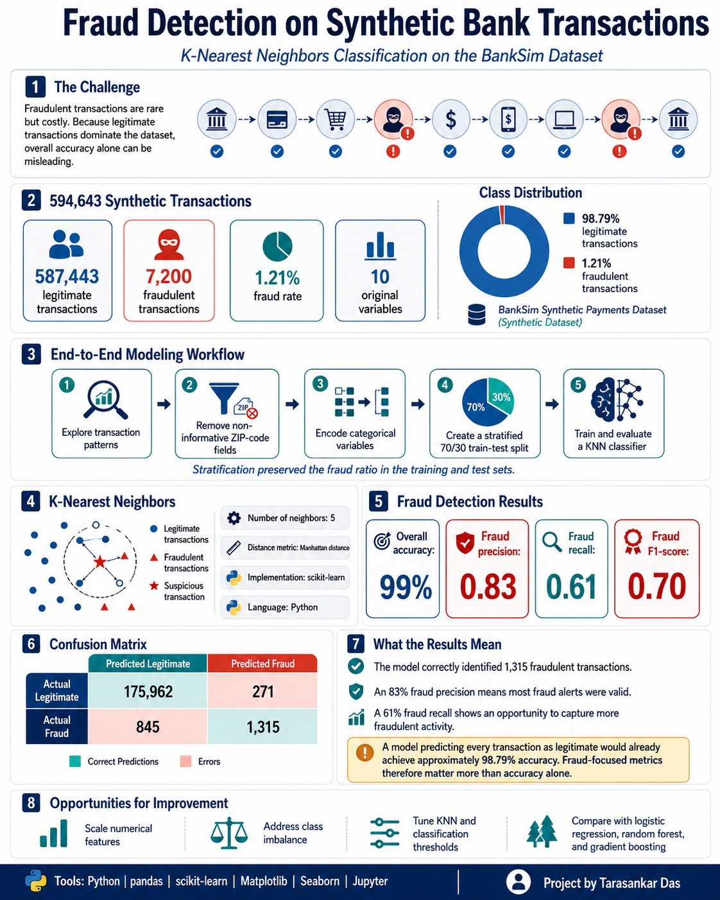

# Fraud Detection on Synthetic Bank Transactions

A machine-learning project that detects fraudulent transactions in the **BankSim synthetic payments dataset** using a **K-Nearest Neighbors (KNN)** classifier.

The project covers exploratory data analysis, preprocessing of categorical transaction data, stratified train-test splitting, model training, and evaluation with fraud-focused metrics.


<p align="center">
  
</p>


## Project Highlights

- Analyzed **594,643 transactions**, including **7,200 fraudulent** and **587,443 legitimate** payments.
- Identified a highly imbalanced target distribution, with fraud representing approximately **1.21%** of all transactions.
- Built a **KNN classifier** with 5 neighbors and Manhattan distance.
- Achieved:
  - **99% overall accuracy**
  - **0.83 precision** for fraud
  - **0.61 recall** for fraud
  - **0.70 F1-score** for fraud
- Correctly identified **1,315 of 2,160** fraudulent transactions in the test set.

## Business Problem

Fraud detection is an imbalanced classification problem: fraudulent transactions are rare, but failing to detect them can be costly. Because a model can achieve high accuracy simply by predicting most transactions as legitimate, this project emphasizes **precision, recall, F1-score, the confusion matrix, and ROC-AUC** rather than accuracy alone.

## Dataset

The notebook uses the file:

```text
bs140513_032310.csv
```

The dataset contains synthetic bank-payment records with the following fields:

| Feature | Description |
|---|---|
| `step` | Time step associated with the transaction |
| `customer` | Anonymized customer identifier |
| `age` | Customer age group |
| `gender` | Customer gender |
| `zipcodeOri` | Customer ZIP-code field |
| `merchant` | Anonymized merchant identifier |
| `zipMerchant` | Merchant ZIP-code field |
| `category` | Merchant or transaction category |
| `amount` | Transaction amount |
| `fraud` | Target label: 1 for fraud and 0 for legitimate |

> The dataset file is not included in this repository. Add the appropriate source and usage instructions before redistribution.

## Exploratory Data Analysis

The analysis includes:

- Fraud and non-fraud transaction counts
- Average transaction amount and fraud rate by category
- Transaction-amount distributions for fraudulent and legitimate payments
- Review of low-information fields
- Comparison against a majority-class baseline

Two ZIP-code columns were removed because each contained only one unique value and therefore provided no predictive information.

## Data Preparation

The preprocessing workflow:

1. Drops `zipcodeOri` and `zipMerchant`.
2. Converts object-based columns to categorical variables.
3. Encodes categorical values as integer category codes.
4. Separates predictors from the `fraud` target.
5. Creates a **70/30 stratified train-test split** using `random_state=42`.

Stratification preserves the fraud proportion in both training and test sets.

## Model

The final model is a K-Nearest Neighbors classifier:

```python
KNeighborsClassifier(
    n_neighbors=5,
    p=1
)
```

Here, `p=1` applies Manhattan distance.

## Results

### Fraud-Class Performance

| Metric | Score |
|---|---:|
| Precision | 0.83 |
| Recall | 0.61 |
| F1-score | 0.70 |
| Overall accuracy | 0.99 |

### Confusion Matrix

| | Predicted Legitimate | Predicted Fraud |
|---|---:|---:|
| Actual Legitimate | 175,962 | 271 |
| Actual Fraud | 845 | 1,315 |

The model produced relatively few false-positive fraud alerts, reflected in its **0.83 fraud precision**. Its **0.61 fraud recall** indicates that it detected 61% of fraudulent transactions while missing 845 fraud cases.

## Why Accuracy Is Not Enough

A classifier that labels every transaction as legitimate would achieve a baseline accuracy of approximately **98.79%** because fraud is rare. Therefore, the fraud-class F1-score, precision, recall, confusion matrix, and ROC curve provide a more meaningful assessment of model quality.

## Repository Structure

```text
.
├── Fraud_modeling.ipynb
├── README.md
└── bs140513_032310.csv   # Add locally; not included
```

## Getting Started

### 1. Clone the repository

```bash
git clone <your-repository-url>
cd <your-repository-name>
```

### 2. Create and activate a virtual environment

```bash
python -m venv .venv
```

On Windows:

```bash
.venv\Scripts\activate
```

On macOS or Linux:

```bash
source .venv/bin/activate
```

### 3. Install dependencies

```bash
pip install pandas numpy matplotlib seaborn scikit-learn xgboost jupyter
```

### 4. Add the dataset

Place `bs140513_032310.csv` in the project directory.

### 5. Run the notebook

```bash
jupyter notebook Fraud_modeling.ipynb
```

## Technologies

- Python
- pandas
- NumPy
- scikit-learn
- Matplotlib
- Seaborn
- Jupyter Notebook

## Limitations

- Integer category encoding may introduce artificial ordering among categorical values.
- KNN can be computationally expensive on large datasets.
- The numerical features were not scaled before distance-based modeling.
- The project uses one train-test split rather than cross-validation.
- The model does not apply resampling, class weighting, threshold optimization, or cost-sensitive learning.
- The dataset is synthetic, so production performance may differ on real banking data.

## Potential Improvements

- One-hot encode or appropriately embed categorical variables.
- Scale numerical features before fitting KNN.
- Compare KNN with logistic regression, random forest, gradient boosting, and XGBoost.
- Address class imbalance using resampling or cost-sensitive methods.
- Tune hyperparameters with cross-validation.
- Optimize the classification threshold based on fraud-detection costs.
- Add precision-recall curves and average precision.
- Build a reproducible preprocessing and modeling pipeline.
- Add model explainability and error analysis.

## Key Takeaway

The project demonstrates an end-to-end fraud-detection workflow on highly imbalanced transaction data. The KNN model achieved strong fraud precision and a useful F1-score, while the results also show why fraud recall and business costs should guide further model improvement.

## Author

**Tarasankar Das**
